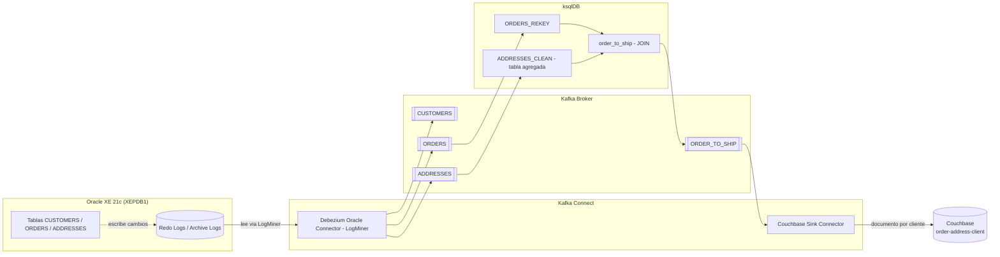
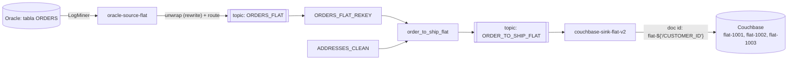
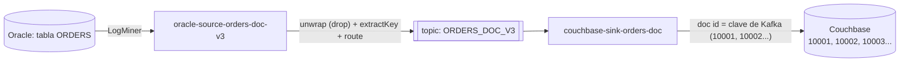

# CDC con Debezium, Kafka Connect, Oracle, ksqlDB y Couchbase

Proyecto de práctica de **Change Data Capture (CDC)**: captura de cambios en
una base de datos Oracle vía Debezium/LogMiner, publicación en Kafka,
transformación con ksqlDB, y sink final a Couchbase. Corre sobre Confluent
Platform 7.5.0 en Docker, con Docker Engine nativo dentro de WSL (sin Docker
Desktop).

Basado originalmente en la serie de artículos de Zamir Arif
([Parte 1 — Debezium MySQL](https://www.linkedin.com/pulse/deploying-debezium-mysql-sink-connector-using-confluent-zamir-arif/),
[Parte 2 — Transformación con KSQL](https://www.linkedin.com/pulse/transform-raw-data-using-ksql-part-2-zamir-arif/),
Parte 3 — Sink a Couchbase),
adaptada y ampliada considerablemente: MySQL sustituido por Oracle como
origen, entorno migrado de Docker Desktop a Docker Engine nativo en WSL, y
sintaxis actualizada a las versiones actuales de Debezium (2.4) y ksqlDB
(7.5) frente a las de 2019 usadas en los artículos originales.

## Índice

1. [Arquitectura y flujo de datos](#arquitectura-y-flujo-de-datos)
2. [Servicios del stack](#servicios-del-stack)
3. [Cómo arrancar todo (runbook rápido)](#cómo-arrancar-todo-runbook-rápido)
4. [Migración a Oracle y LogMiner](#migración-a-oracle-y-logminer)
5. [Conector Debezium Oracle](#conector-debezium-oracle)
6. [ksqlDB: transformación y JOIN (Parte 2)](#ksqldb-transformación-y-join-parte-2)
7. [Sink a Couchbase (Parte 3)](#sink-a-couchbase-parte-3)
   - [Vía inversa: Couchbase → Kafka](#vía-inversa-couchbase--kafka)
   - [Limitación conocida: DELETE no se propaga](#limitación-conocida-los-delete-en-oracle-no-se-propagan-hasta-couchbase)
   - [Rediseño: propagar el DELETE hasta Couchbase](#rediseño-propagar-el-dato-de-un-delete-hasta-couchbase)
   - [Borrado físico real: documento por pedido](#borrado-físico-real-pipeline-documento-por-pedido)
8. [Migración de Docker Desktop a Docker Engine en WSL](#migración-de-docker-desktop-a-docker-engine-en-wsl)
9. [Catálogo de problemas mayores y soluciones](#catálogo-de-problemas-mayores-y-soluciones)
10. [Próximos pasos](#próximos-pasos)

---

## Arquitectura y flujo de datos



**Resumen del flujo:** cada cambio confirmado (`COMMIT`) en Oracle se
captura vía LogMiner y se publica en Kafka (Avro + Schema Registry). ksqlDB
aplana los eventos, los re-particiona por clave de negocio (`PURCHASER`/
`CUSTOMER_ID`), agrega `ADDRESSES` a una tabla consultable, une pedidos con
direcciones (`order_to_ship`), y un sink connector escribe el resultado en
Couchbase — un documento por cliente con su último pedido y su dirección de
envío.

## Servicios del stack

| Servicio | Rol |
|---|---|
| `zookeeper` / `broker` | Coordinación y almacenamiento de Kafka |
| `schema-registry` | Registro de esquemas Avro |
| `connect` | Kafka Connect (Debezium Oracle + Couchbase Sink instalados vía Dockerfile, imagen base `cp-server-connect-base`) |
| `oracle` | Base de datos origen (Oracle XE 21c, arquitectura CDB/PDB) |
| `couchbase-server` | Destino final del pipeline (bucket `order-address-client`) |
| `ksqldb-server` / `ksqldb-cli` | Transformación y consultas SQL sobre streams de Kafka |
| `rest-proxy`, `akhq`, `control-center` | REST API y UIs de administración de Kafka (ambas UIs disponibles en paralelo) |
| `appserver` | Servicio propio del repo original |

MySQL ya no forma parte del stack (ver catálogo de problemas para el
porqué).

## Cómo arrancar todo (runbook rápido)

Ver `runbook-oracle.md` para el detalle completo. Resumen:

```bash
cd "/mnt/c/Users/juan.callejovidal/Desktop/primera practica kafka 21_08_26/docker-test-debezium-couchbase"
sudo systemctl start docker   # si no arrancó solo con systemd
docker compose up -d
docker compose ps
```

## Migración a Oracle y LogMiner

- **Imagen:** `gvenzl/oracle-xe:21-slim`. Arquitectura multi-tenant CDB/PDB —
  los datos viven en la pluggable database `XEPDB1`.
- **Esquema:** tablas `CUSTOMERS`, `ORDERS`, `ADDRESSES` (equivalentes a la
  base `inventory` original de MySQL) en el esquema `DEBEZIUM`.
- **LogMiner:** requiere modo `ARCHIVELOG`, supplemental logging a nivel de
  base y de tabla (`ADD SUPPLEMENTAL LOG DATA (ALL) COLUMNS`), y un usuario
  **común** `C##DBZUSER` (creado en `CDB$ROOT` con `CONTAINER=ALL`) con los
  privilegios de LogMiner — distinto del usuario `debezium` local a
  `XEPDB1`, que solo sirve para crear/consultar tablas de negocio. Script
  completo: `oracle-logminer-setup.sql`.
- **Driver JDBC** (`ojdbc8`) descargado aparte desde Maven Central en el
  `Dockerfile`, ya que Debezium no lo redistribuye por licencia.

## Conector Debezium Oracle

Configuración vigente (`oracle-source-v3.json`) — usa `topic.prefix`,
`database.pdb.name`, y un `RegexRouter` que simplifica los nombres de topic
de `prefix.ESQUEMA.TABLA` a solo `TABLA`:

```json
{
    "name": "oracle-source-v3",
    "config": {
        "connector.class": "io.debezium.connector.oracle.OracleConnector",
        "database.hostname": "oracle",
        "database.user": "c##dbzuser",
        "database.password": "dbz",
        "database.dbname": "XE",
        "database.pdb.name": "XEPDB1",
        "topic.prefix": "oracle-server-v3",
        "table.include.list": "DEBEZIUM.CUSTOMERS,DEBEZIUM.ORDERS,DEBEZIUM.ADDRESSES",
        "schema.history.internal.kafka.topic": "schema-changes.oracle-v3",
        "transforms": "route",
        "transforms.route.type": "org.apache.kafka.connect.transforms.RegexRouter",
        "transforms.route.regex": "([^.]+)\\.([^.]+)\\.([^.]+)",
        "transforms.route.replacement": "$3"
    }
}
```

Nota de tipos: las columnas `NUMBER(10)` de Oracle se serializan como
`int64` (no `int32`) al no caber en un entero de 32 bits — hay que declarar
`BIGINT` en ksqlDB, no `INTEGER`, para los campos numéricos.

## ksqlDB: transformación y JOIN (Parte 2)

Pipeline completo, adaptado de la sintaxis de 2019 (KSQL 5.3) a ksqlDB 7.5:

```sql
-- Streams en bruto: solo el struct AFTER, tipos BIGINT por el tamaño de NUMBER(10)
CREATE STREAM orders (
  after STRUCT<order_number BIGINT, order_date BIGINT, purchaser BIGINT, quantity BIGINT, product_id BIGINT>
) WITH (kafka_topic='ORDERS', value_format='AVRO');

CREATE STREAM addresses (
  after STRUCT<id BIGINT, customer_id BIGINT, street VARCHAR, city VARCHAR, state VARCHAR, zip VARCHAR, type VARCHAR>
) WITH (kafka_topic='ADDRESSES', value_format='AVRO');

-- Aplanar y re-particionar por la clave de negocio
CREATE STREAM ORDERS_REKEY AS
SELECT AFTER->ORDER_NUMBER AS ORDER_NUMBER, AFTER->ORDER_DATE AS ORDER_DATE,
       AFTER->PURCHASER AS PURCHASER, AFTER->QUANTITY AS QUANTITY, AFTER->PRODUCT_ID AS PRODUCT_ID
FROM orders PARTITION BY AFTER->PURCHASER;

CREATE STREAM ADDRESSES_REKEY AS
SELECT AFTER->ID AS ID, AFTER->CUSTOMER_ID AS CUSTOMER_ID, AFTER->STREET AS STREET,
       AFTER->CITY AS CITY, AFTER->STATE AS STATE, AFTER->ZIP AS ZIP, AFTER->TYPE AS TYPE
FROM addresses PARTITION BY AFTER->CUSTOMER_ID;

-- Tabla consultable: agregación con LATEST_BY_OFFSET (NO un CREATE TABLE directo sobre el topic)
CREATE TABLE ADDRESSES_CLEAN AS
SELECT CUSTOMER_ID, LATEST_BY_OFFSET(ID) AS ID, LATEST_BY_OFFSET(STREET) AS STREET,
       LATEST_BY_OFFSET(CITY) AS CITY, LATEST_BY_OFFSET(STATE) AS STATE,
       LATEST_BY_OFFSET(ZIP) AS ZIP, LATEST_BY_OFFSET(TYPE) AS TYPE
FROM ADDRESSES_REKEY GROUP BY CUSTOMER_ID;

-- JOIN final: pedido + dirección de envío
CREATE STREAM order_to_ship AS
SELECT o.ORDER_NUMBER, o.ORDER_DATE, o.PURCHASER, o.QUANTITY, o.PRODUCT_ID,
       a.STREET, a.CITY, a.STATE, a.ZIP, a.TYPE
FROM ORDERS_REKEY o
LEFT JOIN ADDRESSES_CLEAN a ON o.PURCHASER = a.CUSTOMER_ID;
```

**Diferencias clave frente al artículo original (2019, KSQL 5.3):**

- `PARTITION BY` debe referenciar el campo completo (`AFTER->PURCHASER`), no
  el alias — la sintaxis vieja permitía el alias directamente.
- `CREATE TABLE ... WITH (KEY='...', ...)` ya no existe. Además, un
  `CREATE TABLE` declarado directamente sobre un topic (sin agregación) **no
  queda correctamente materializado** para usarse en un `JOIN` — hay que
  construir la tabla con `GROUP BY` + `LATEST_BY_OFFSET` para que sí sea
  consultable y usable en joins.
- Los `SELECT` sobre streams requieren `EMIT CHANGES` explícito.

## Sink a Couchbase (Parte 3)

- **Setup de Couchbase:** clúster nuevo vía UI (`localhost:8091`), bucket
  `order-address-client` creado manualmente.
- **Conector:** el artículo usa `kafka-connect-couchbase 3.4.5` (2019),
  incompatible con la imagen `couchbase/server:latest` actual — se instaló
  la versión **4.3.5**, que además **renombró las propiedades de
  configuración**:

  | v3.x (artículo) | v4.x (actual) |
  |---|---|
  | `connection.cluster_address` | `couchbase.seed.nodes` |
  | `connection.username` | `couchbase.username` |
  | `connection.password` | `couchbase.password` |
  | `connection.bucket` | `couchbase.bucket` |

- **Clave del mensaje:** el topic `ORDER_TO_SHIP` usa una clave `BIGINT`
  (binaria), no un string. Usar `key.converter: StringConverter` (como el
  artículo) corrompe la clave al intentar leerla como texto, y distintos
  clientes acaban colisionando en el mismo documento. La solución es
  `key.converter: org.apache.kafka.connect.converters.LongConverter`.

  Configuración final (`couchbase-sink-v2.json`):

  ```json
  {
      "name": "couchbase-sink-v2",
      "config": {
          "connector.class": "com.couchbase.connect.kafka.CouchbaseSinkConnector",
          "topics": "ORDER_TO_SHIP",
          "couchbase.seed.nodes": "couchbase",
          "couchbase.bucket": "order-address-client",
          "couchbase.username": "Administrator",
          "couchbase.password": "<tu contraseña>",
          "key.converter": "org.apache.kafka.connect.converters.LongConverter",
          "value.converter": "io.confluent.connect.avro.AvroConverter",
          "value.converter.schema.registry.url": "http://schema-registry:8081",
          "value.converter.schemas.enable": "false",
          "consumer.override.auto.offset.reset": "earliest"
      }
  }
  ```

- **Resultado:** un documento por cliente en Couchbase (clave = `CUSTOMER_ID`),
  con su pedido más reciente y la dirección de envío ya resuelta por el
  `JOIN` de ksqlDB.

### Vía inversa: Couchbase → Kafka

Se añadió también un **source connector** de Couchbase
(`couchbase-source.json`), que usa DCP para capturar cualquier cambio en el
bucket `order-address-client` (altas, modificaciones y borrados) y
publicarlo en un topic nuevo, `COUCHBASE_ORDER_UPDATES` — distinto de
`ORDER_TO_SHIP` para no crear un bucle con el sink. Configuración clave:
`couchbase.source.handler: RawJsonSourceHandler` (publica el documento tal
cual) junto con `value.converter: ByteArrayConverter`, y `key.converter:
StringConverter` (aquí sí es correcto, porque el ID del documento en
Couchbase ya es un string, a diferencia de la clave `BIGINT` del topic
`ORDER_TO_SHIP`).

Se verificó en vivo el ciclo completo de punta a punta: un `INSERT` en
Oracle se propaga correctamente a través de las 7 etapas (Oracle → Debezium
→ Kafka → ksqlDB/JOIN → Kafka → Couchbase Sink → Couchbase → Couchbase
Source → Kafka) en cuestión de segundos. Un borrado manual de un documento
directamente en Couchbase también se propaga correctamente como un
*tombstone* (mensaje con la misma clave y valor `null`) en
`COUCHBASE_ORDER_UPDATES`.

### Limitación conocida: los `DELETE` en Oracle no se propagan hasta Couchbase

Un `DELETE` sobre la tabla `orders` en Oracle **no llega** a Couchbase, a
diferencia de los `INSERT`/`UPDATE`. Causa raíz, confirmada paso a paso con
`PRINT` en cada topic intermedio:

1. Debezium captura el `DELETE` correctamente (`op:"d"`, `before` con los
   datos reales de la fila borrada, `after: null`, más un *tombstone*).
2. Como el stream `orders` en ksqlDB solo declara el struct `after` (nunca
   se capturó `before` ni `op`), el evento de borrado llega con **todos los
   campos en `null`**, incluida la clave de negocio (`PURCHASER`).
3. Kafka Streams (el motor de ksqlDB) **descarta silenciosamente cualquier
   registro con clave `null` en un `JOIN` stream-tabla**, antes siquiera de
   evaluar la condición `ON`. Por eso el borrado nunca llega a
   `order_to_ship`, y de ahí nunca llega a Couchbase — sin ningún error ni
   log visible que lo señale.

Para propagar deletes correctamente habría que rediseñar los streams
capturando también `before`/`op`, y construir la lógica de forma que, cuando
`after` sea `null`, se use `before` para determinar la clave y emitir un
evento de borrado explícito hacia Couchbase (por ejemplo, produciendo un
mensaje con valor `null` a la clave correspondiente). No implementado en
esta práctica — queda como mejora futura.

### Rediseño: propagar el dato de un DELETE hasta Couchbase

Se construyó un **pipeline paralelo** (sin tocar el original) que sí
propaga el dato de un `DELETE` de punta a punta, usando la transformación
idiomática de Debezium para este problema: `ExtractNewRecordState` en modo
`rewrite`.



**Conector `oracle-source-flat.json`** — captura solo `DEBEZIUM.ORDERS`, con
dos transformaciones encadenadas:

```json
"transforms": "unwrap,route",
"transforms.unwrap.type": "io.debezium.transforms.ExtractNewRecordState",
"transforms.unwrap.delete.handling.mode": "rewrite",
"transforms.unwrap.drop.tombstones": "false",
"transforms.route.type": "org.apache.kafka.connect.transforms.RegexRouter",
"transforms.route.regex": "([^.]+)\\.([^.]+)\\.([^.]+)",
"transforms.route.replacement": "$3_FLAT"
```

`delete.handling.mode: rewrite` es la clave: en vez de dejar `after: null`
en un borrado, **reescribe el registro usando el estado `before`** (los
valores de la fila justo antes de eliminarse) y añade un campo `__deleted:
"true"`. Esto significa que la clave de negocio (`PURCHASER`) sobrevive al
borrado — a diferencia del pipeline original, donde se perdía por completo.
El resultado son registros **planos** en el topic `ORDERS_FLAT` (sin el
struct `after` anidado), con tipos `BIGINT` para los numéricos (por el
tamaño de `NUMBER(10)` en Oracle) y `VARCHAR` para `__deleted`.

**Pipeline ksqlDB equivalente**, replicando `ORDERS_REKEY`/`order_to_ship`
pero sobre los datos planos:

```sql
CREATE STREAM orders_flat (
  ORDER_NUMBER BIGINT, ORDER_DATE BIGINT, PURCHASER BIGINT,
  QUANTITY BIGINT, PRODUCT_ID BIGINT, __deleted VARCHAR
) WITH (KAFKA_TOPIC='ORDERS_FLAT', VALUE_FORMAT='AVRO');

CREATE STREAM ORDERS_FLAT_REKEY AS
SELECT ORDER_NUMBER, ORDER_DATE, PURCHASER, QUANTITY, PRODUCT_ID, __deleted
FROM orders_flat
PARTITION BY PURCHASER;

CREATE STREAM order_to_ship_flat AS
SELECT o.PURCHASER, o.ORDER_NUMBER, o.ORDER_DATE, (o.PURCHASER + 0) AS CUSTOMER_ID,
       o.QUANTITY, o.PRODUCT_ID, o.__deleted,
       a.STREET, a.CITY, a.STATE, a.ZIP, a.TYPE
FROM ORDERS_FLAT_REKEY o
LEFT JOIN ADDRESSES_CLEAN a ON o.PURCHASER = a.CUSTOMER_ID;
```

**Hallazgo importante sobre columnas de clave en ksqlDB:** una columna que
es la *clave* de un stream (como `PURCHASER`, resultado de un `PARTITION
BY`) sigue tratándose como columna de clave en todas las transformaciones
posteriores, **incluso si le pones un alias distinto** — nunca se serializa
dentro del cuerpo (`value`) del mensaje, solo como `key` de Kafka. Esto
importa porque `couchbase.document.id` (ver más abajo) solo puede leer
campos del *cuerpo*, nunca la clave. La solución fue forzar un cálculo
trivial que rompe ese seguimiento: `(o.PURCHASER + 0) AS CUSTOMER_ID` — la
suma obliga a ksqlDB a tratarlo como un valor calculado real, que sí queda
en el cuerpo. ksqlDB además exige que la columna de clave original del
`JOIN` (`o.PURCHASER`) siga presente tal cual en el `SELECT`, aunque ya
tengas la copia calculada.

**Conector `couchbase-sink-flat-v2.json`:**

```json
"couchbase.document.id": "flat-${/CUSTOMER_ID}",
"key.converter": "org.apache.kafka.connect.converters.LongConverter",
"consumer.override.auto.offset.reset": "earliest"
```

`couchbase.document.id` usa sintaxis de **JSON Pointer** (`${/campo}`) para
referenciar campos del *cuerpo* del mensaje — no existe una forma de
referenciar directamente la clave de Kafka con un placeholder tipo
`${key}`; si no se especifica esta propiedad, el conector usa la clave tal
cual. El prefijo `flat-` en los IDs de documento (`flat-1001`, `flat-1002`,
`flat-1003`) evita colisionar con los documentos del pipeline original
(`1001`, `1002`, `1003`).

**Resultado final verificado:** el documento `flat-1002` en Couchbase
contiene el pedido `10005` (el mismo que se borró de verdad en Oracle) con
`"__DELETED":"true"` y la dirección de envío completamente resuelta — el
dato del borrado llega íntegro hasta el final del pipeline, resolviendo el
problema de raíz documentado en la sección anterior.

**Incidente durante la construcción (y cómo se resolvió):** un primer
intento de `couchbase.document.id` usando `${/PURCHASER}` sin la corrección
del `+0` no encontró ese campo en el cuerpo (por el motivo explicado
arriba), y el conector cayó de vuelta silenciosamente a usar la clave de
Kafka tal cual — que coincidía con los IDs del pipeline original (`1001`,
`1002`, `1003`), **sobrescribiendo temporalmente esos documentos** con los
datos del pipeline flat. Se restauraron registrando un conector temporal
(mismo `key.converter`, mismo topic `ORDER_TO_SHIP`,
`consumer.override.auto.offset.reset=earliest`) que releyó el historial
completo y reconstruyó el estado correcto, antes de borrarlo. Lección: al
introducir un `couchbase.document.id` personalizado, conviene verificar
primero con `PRINT` que el campo referenciado realmente aparece en el
cuerpo del mensaje, antes de apuntar el sink a un bucket con datos ya en
uso.

### Borrado físico real: pipeline "documento por pedido"

El pipeline `_flat` propaga el *dato* de un borrado (`__deleted: true`),
pero nunca elimina el documento en sí — para eso Couchbase necesita recibir
un mensaje con **valor `null`** (un *tombstone* real), y **ksqlDB no tiene
forma de producir eso** desde un `JOIN` o un `SELECT` (solo puede poner
campos individuales a `null`, nunca el mensaje completo). La solución fue
cambiar de modelo: en vez de "un documento por cliente con dirección
resuelta", **un documento por pedido, espejo 1:1 de la fila de Oracle**, sin
pasar por ksqlDB en absoluto — solo dos conectores encadenados.



**Conector `oracle-source-orders-doc-v3.json`:**

```json
"transforms": "unwrap,extractKey,route",
"transforms.unwrap.type": "io.debezium.transforms.ExtractNewRecordState",
"transforms.unwrap.delete.handling.mode": "drop",
"transforms.unwrap.drop.tombstones": "false",
"transforms.extractKey.type": "org.apache.kafka.connect.transforms.ExtractField$Key",
"transforms.extractKey.field": "ORDER_NUMBER",
"errors.tolerance": "all",
"errors.log.enable": "true"
```

Diferencias clave frente al pipeline `_flat`:

- **`delete.handling.mode: "drop"`** (el valor por defecto de Debezium) en
  vez de `rewrite` — este modo sí produce un valor `null` real en el
  borrado, justo lo que necesita Couchbase para interpretar un borrado
  físico.
- **`ExtractField$Key`** — transformación estándar de Kafka Connect (no de
  Debezium) que convierte la clave nativa de Debezium (una estructura
  compuesta, `Struct{ORDER_NUMBER=10001}`) en un valor simple
  (`10001`), listo para usar directamente como ID de documento sin más
  transformaciones.
- **`errors.tolerance: "all"`** — un registro concreto (de origen no
  identificado, probablemente un evento interno puntual) hacía fallar
  `ExtractField$Key` con `Unknown field: ORDER_NUMBER`, aunque se comprobó
  con un conector de diagnóstico que las estructuras de clave de los
  pedidos reales sí tenían ese campo correctamente. Con `errors.tolerance:
  all`, la tarea salta ese registro puntual en vez de morir, y los pedidos
  reales se procesan sin problema.

**Conector `couchbase-sink-orders-doc.json`:** sin `couchbase.document.id`
personalizado — usa la clave de Kafka tal cual (`10001`, `10002`...) como
ID de documento. No hay colisión con los IDs de los otros dos pipelines
(`1001`-`1004` de clientes, `flat-1001`... del pipeline flat) porque los
números de pedido tienen 5 cifras.

**Resultado verificado en vivo:** al borrar el pedido `10004` en Oracle
(`DELETE FROM orders WHERE order_number = 10004; COMMIT;`), el documento
`10004` **desapareció por completo** del bucket de Couchbase — de 10
documentos totales a 9 — confirmando un borrado físico real de punta a
punta, no solo un marcador. En paralelo, el pipeline `_flat` capturó el
mismo evento y actualizó `flat-1003` con `__DELETED: "true"`, demostrando
que ambas estrategias conviven sin interferirse, cada una capturando el
mismo cambio real de Oracle a su manera.

**Trade-off aceptado:** este modelo no incluye la dirección de envío
resuelta (no pasa por el `JOIN` con `ADDRESSES_CLEAN`) — es un espejo
directo de la tabla `orders`, no un documento de negocio enriquecido. Sirve
como demostración de que el borrado físico es alcanzable con Kafka Connect
puro, a costa de renunciar al enriquecimiento vía ksqlDB para ese caso de
uso concreto.

## Migración de Docker Desktop a Docker Engine en WSL

Se detectaron problemas de estabilidad (contenedores caídos, conflictos de
Zookeeper al reiniciar) típicos de Docker Desktop sobre WSL2. Se migró a
**Docker Engine nativo instalado dentro de la distro WSL**, con systemd
habilitado para arranque automático del daemon. Esto implicó reconstruir el
stack completo, ya que el nuevo daemon no comparte imágenes/contenedores con
el de Docker Desktop.

## Catálogo de problemas mayores y soluciones

| Problema | Causa | Solución |
|---|---|---|
| Control Center no detectaba el clúster Connect | Variable de entorno mal formada (guion bajo vs medio) + health check contra un endpoint (`/v1/metadata/id`) inexistente en la imagen community de Kafka Connect | **Resuelto**: cambiar la imagen de `connect` de `cp-kafka-connect` a `confluentinc/cp-server-connect-base:7.5.0`, que sí incluye ese endpoint. Control Center volvió a añadirse al stack (junto a AKHQ, que se mantiene como alternativa) |
| Broker no arrancaba tras reinicios abruptos | Zookeeper conservaba registros efímeros de sesiones anteriores (típico de Docker Desktop en WSL2) | Migración a Docker Engine nativo en WSL |
| Conector Oracle: snapshot se saltaba (`SKIPPED`) y el streaming quedaba roto | Reutilización de un offset guardado de un registro anterior fallido | Registrar el conector con nombre y `topic.prefix` nuevos para forzar snapshot y offset limpios |
| `ADDRESSES_CLEAN` siempre devolvía `null` en el `JOIN` | La tabla se creó directamente sobre un topic (`CREATE TABLE ... WITH (KAFKA_TOPIC=...)`), lo cual no la materializa correctamente para joins en ksqlDB moderno | Reconstruir la tabla con `GROUP BY` + `LATEST_BY_OFFSET` |
| El sink de Couchbase colisionaba distintos clientes en un solo documento | `key.converter: StringConverter` sobre una clave `BIGINT` binaria corrompe el valor | Usar `key.converter: LongConverter` |
| El sink de Couchbase no reprocesaba mensajes tras corregir la config | Reutilizar el mismo nombre de conector reutiliza su *consumer group*, retomando desde el final del topic | Registrar con nombre nuevo (`couchbase-sink-v2`) y `consumer.override.auto.offset.reset=earliest` |
| Build de Couchbase fallaba (`apt-get: command not found`) | La imagen base de `cp-kafka-connect` no es Debian/Ubuntu, no tiene `apt-get` | Usar `jar -xf` (incluido en el JDK) para descomprimir el `.zip` del conector, en vez de `unzip` |
| Un `DELETE` en Oracle no llega a Couchbase (pipeline original) | Los streams solo capturan `after` (null en un delete); Kafka Streams descarta registros con clave `null` en un `JOIN` stream-tabla, silenciosamente | **Resuelto en un pipeline paralelo** (`oracle-source-flat` → `ORDERS_FLAT` → ... → `couchbase-sink-flat-v2`) usando `ExtractNewRecordState` en modo `rewrite`; el pipeline original (`ORDER_TO_SHIP`) se dejó sin modificar |
| `couchbase.document.id` personalizado no encontraba el campo esperado y sobrescribió documentos existentes | El campo era en realidad la *clave* del stream (no un campo del cuerpo), y `couchbase.document.id` solo lee JSON Pointer contra el cuerpo; al no encontrarlo, el conector usó la clave de Kafka tal cual, coincidiendo con IDs ya en uso | Duplicar la clave como columna calculada con `(campo + 0) AS ALIAS` para forzar que quede en el cuerpo; verificar con `PRINT` antes de apuntar un sink a un bucket con datos existentes |
| `ExtractField$Key` fallaba con `Unknown field: ORDER_NUMBER` de forma intermitente | Un registro puntual (origen no identificado) no traía ese campo en la clave, aunque los pedidos reales sí lo tenían (confirmado con un conector de diagnóstico sin la transformación) | Añadir `errors.tolerance: "all"` para que la tarea salte ese registro puntual en vez de morir por completo |

## Próximos pasos

- Aplicar el mismo patrón de documento-por-fila (`ExtractField$Key` +
  `delete.handling.mode: drop`) a `ADDRESSES`, si se quiere borrado físico
  real también para direcciones.
- Considerar unificar los tres pipelines de Couchbase en uno solo con
  lógica más rica (por ejemplo, un consumidor de aplicación que lea el
  flag `__deleted` del pipeline `_flat` y decida cuándo emitir un borrado
  físico), en vez de mantenerlos como demostraciones paralelas
  independientes.
- Limpiar el documento residual con ID corrupto que quedó en Couchbase del
  conector con la configuración antigua (antes de introducir
  `LongConverter`).
- **Rendimiento de WSL2 con este stack.** Con 3 conectores Debezium
  distintos haciendo LogMiner sobre la misma tabla en paralelo, más Oracle,
  Kafka, Couchbase y Control Center simultáneos, `VmmemWSL` (el proceso de
  la VM de WSL2) puede llegar a consumir varios GB de RAM y generar
  bastante I/O de disco sostenido, ralentizando el resto del sistema
  Windows. Mitigaciones aplicadas: mover el proyecto del filesystem de
  Windows (`/mnt/c/...`) al filesystem nativo de Linux dentro de WSL2
  (`~/...`), y parar servicios no usados activamente (`docker compose stop
  akhq control-center ksql-datagen`) cuando no se necesitan. Pendiente:
  considerar limitar la memoria de WSL2 vía `.wslconfig`, o aumentar el
  tamaño de los redo logs de Oracle (aviso visto en los logs: "Redo logs
  may be sized too small... consider increasing redo log sizes to a
  minimum of 500MB") para reducir la frecuencia de cambios de log bajo
  carga de varios conectores LogMiner concurrentes.
